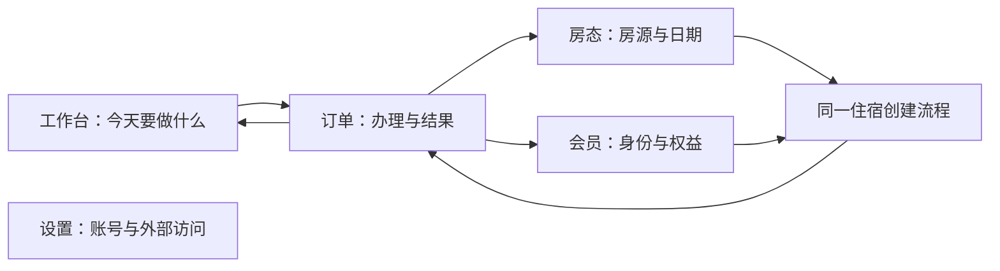

# Green PMS 全链路用户旅程审查

原始审查日期：2026-09-06。审查基线为本地 HEAD `e15c7c6` 及当时已有的未提交改动。第 1–10 节的问题与性能数字保留为审查时证据；2026-09-09 的后续实现和最终验证见文末“Goal 续作”，不能将旧问题描述理解为当前仍未修复。本次开发未提交、推送、部署或操作生产业务数据。

## 1. 优先处理的发现

已发现 2 项 P1 可用性缺陷和 13 项 P2 问题。其中部分 P2 是源码能确认的增长风险，不代表生产系统已经变慢。P1 指特定条件下核心工作入口无法使用；P2 指影响正确识别、恢复、工作效率或后续规模的实质问题。以下编号用于追踪，不替代项目的 A/B 风险分级。

### F01 · P1 · 订单详情每 4 秒刷新，会持续丢弃超过 4 秒的成功响应

**触发与影响：** 打开订单详情，读取耗时超过轮询间隔时，新一轮刷新会把上一轮标记为失效。服务端持续返回成功，页面仍持续显示“正在载入订单详情”，操作者无法收款、修改安排或办理退房。

**证据：** 浏览器给详情响应增加 4,500 ms 延迟，约 14 秒内发出 4 次请求，3 次完成 HTTP 200，页面仍在加载。[延迟实验记录](</Users/feather/Documents/Codex project/Green PMS/docs/audits/user-journey-2026-09-06/evidence/latency-results.json>)；[现场截图](</Users/feather/Documents/Codex project/Green PMS/docs/audits/user-journey-2026-09-06/evidence/order-detail-slow-response.png>)。源码在 [OrderDetailPage.tsx](</Users/feather/Documents/Codex project/Green PMS/apps/web/src/pages/OrderDetailPage.tsx:1787>)：定时器修改刷新标记，依赖变化执行 cleanup，将旧请求的 `current` 设为 false。

**建议：** 当前请求结束后再安排下一次刷新；同一订单同一身份避免重叠请求；切换订单时取消旧请求。页面已拥有有效内容时保留内容，以独立状态说明后台刷新进度。

**完成标准：** 2、4.5、8 秒成功响应均可最终展示；无持续叠加的同类请求；离开旧订单后，旧响应不能覆盖新订单。读优化不能取消确认阶段的订单版本检查。

### F02 · P1 · 房态会拒绝约 2 秒以上的成功响应，最终不显示房态

**触发与影响：** 房态有效期为 5 秒，客户端要求安装响应时至少保留 3 秒余量，恢复阶段要求 4 秒。成功响应稍慢就被拒绝，重试后页面停止展示房态。现场正常网络变慢也可能被用户理解成“系统没有房间”或“系统故障”。

**证据：** 给房态响应增加 2,100 ms 延迟，三次 HTTP 200 后房态格子数仍为 0，页面出现“状态未知，未显示为可售”。[现场截图](</Users/feather/Documents/Codex project/Green PMS/docs/audits/user-journey-2026-09-06/evidence/room-status-slow-response.png>)；[实验数据](</Users/feather/Documents/Codex project/Green PMS/docs/audits/user-journey-2026-09-06/evidence/latency-results.json>)。有效期在 [room-status.ts](</Users/feather/Documents/Codex project/Green PMS/packages/db/src/room-status.ts:1218>)；余量和安装判断在 [InventoryPage.tsx](</Users/feather/Documents/Codex project/Green PMS/apps/web/src/pages/InventoryPage.tsx:2403>)、[响应安装判断](</Users/feather/Documents/Codex project/Green PMS/apps/web/src/pages/InventoryPage.tsx:2725>)，拒绝及重试在同文件 3745 行附近。

**建议：** 分开“允许查看带时间戳的数据”和“允许据此发起写入”。过期数据可供理解历史状态，但必须明确标为待更新，不能继续显示为当前可售或据此承诺库存。写入仍走服务端实时核对、版本与事务校验；读取新鲜度策略需要按对应 A 级规格协调。

**完成标准：** 成功的慢读取不产生永久空白；用户知道数据时间、当前哪些操作暂停以及下一步；过期页面、并发占房、权限变化仍不能绕过写入门禁。不能只把 TTL 调大作为修复。

### F03 · P2 · 后台读取失败会抹掉尚未提交的表单

**触发与影响：** 用户正在填写收款，后台详情刷新偶发失败，整页切成错误状态，表单被卸载；下一次读取成功后，表单重新出现但输入已清空。长表单和交易单号尤其容易造成重复劳动及抄录错误。

**证据：** 填入金额 `123.45` 和交易单号 `AUDIT-UNSAVED-ONLY`，注入一次 503，恢复后两个字段都为空。本次未提交收款。[前后字段记录](</Users/feather/Documents/Codex project/Green PMS/docs/audits/user-journey-2026-09-06/evidence/form-results.json>)；[刷新失败](</Users/feather/Documents/Codex project/Green PMS/docs/audits/user-journey-2026-09-06/evidence/edit-form-refresh-failure.png>)；[恢复后输入丢失](</Users/feather/Documents/Codex project/Green PMS/docs/audits/user-journey-2026-09-06/evidence/edit-form-values-lost.png>)。[OrderDetailPage.tsx](</Users/feather/Documents/Codex project/Green PMS/apps/web/src/pages/OrderDetailPage.tsx:1829>) 设置整页错误，2034 行附近提前返回，卸载表单。

**建议：** 区分首次读取错误与后台刷新错误。读失败保留草稿和已显示内容；涉及数据版本变化时说明哪些字段需要重新核对。草稿绑定账号、门店和订单，身份或授权变化时不得向新身份继续展示原资料。

**完成标准：** 网络中断、单次 503、重试不会清空同一有效会话的输入；恢复后先重新核对再提交；未确认与结果未知的操作继续保留各自的恢复语义。

### F04 · P2 · 住客资料更正后，订单详情、列表和搜索不一致

**触发与影响：** 更正住客昵称、姓名或手机号后，详情显示新资料，订单列表继续显示旧资料，搜索新昵称找不到订单。前台会误以为修改失败、订单丢失，或打开错误订单。

**证据：** 在本轮独立测试库通过正式核对和确认执行 `CORRECT_ORDER_OCCUPANT`，回执已提交；详情出现“审查更正后的昵称”，列表仍是“小满”，搜索新昵称为 `0 / 8`。[提交与读模型对照](</Users/feather/Documents/Codex project/Green PMS/docs/audits/user-journey-2026-09-06/evidence/runtime-results.json>)；[搜索结果截图](</Users/feather/Documents/Codex project/Green PMS/docs/audits/user-journey-2026-09-06/evidence/corrected-name-search-empty.png>)。[server.ts](</Users/feather/Documents/Codex project/Green PMS/apps/api/src/server.ts:787>) 返回原始订单快照；[OrdersPage.tsx](</Users/feather/Documents/Codex project/Green PMS/apps/web/src/pages/OrdersPage.tsx:262>) 使用该快照搜索；[OrderDetailPage.tsx](</Users/feather/Documents/Codex project/Green PMS/apps/web/src/pages/OrderDetailPage.tsx:2097>) 使用更正后的主要住宿人。

**建议：** 保留不可变原始快照，增加统一的“当前住宿人”读取投影，供订单列表、搜索、今日任务与详情共用。不要为解决显示问题直接覆盖原始业务事实。

**完成标准：** 更正后按当前昵称、姓名、手机号可查到原订单，各入口显示一致，历史更正仍可追溯，会员主档不被隐式修改。

### F05 · P2 · 会话失效后没有直接重新登录的恢复路径

**触发与影响：** 使用过程中 Cookie 失效，页面保留旧身份和“可写”标志，只显示英文鉴权错误，操作者不知道应重试、退出还是联系管理员。

**证据：** 清除浏览器 Cookie 后刷新订单，显示 `AUTHENTICATION_REQUIRED: Authentication is required` 和 `Correlation ID`，没有登录表单或“重新登录”按钮；还同时出现“没有匹配订单”。[失效现场](</Users/feather/Documents/Codex project/Green PMS/docs/audits/user-journey-2026-09-06/evidence/session-expired-orders.png>)。[App.tsx](</Users/feather/Documents/Codex project/Green PMS/apps/web/src/App.tsx:41>) 只在初始化检查会话；[api.ts](</Users/feather/Documents/Codex project/Green PMS/apps/web/src/api.ts:71>) 抛出请求错误，没有驱动应用进入过期状态。

**建议：** 统一处理会话失效，明确提示“登录已过期，请重新登录”；403 权限不足单独处理。重新登录后按同一身份及当前权限恢复原工作，结果未知的命令先查原结果，不能用新幂等键再提交。

**完成标准：** 有明确且可达的重新登录入口；失效期间不继续显示当前可写；错误和空列表状态互斥；跨账号不得恢复他人草稿或恢复记录。

### F06 · P2 · “今日异常”把已结束的取消与未到订单永久列为待处理

**触发与影响：** 只要状态为取消或未到，就进入异常队列，不论日期以及是否还有待办。使用越久，异常越多，操作者难以判断真正需要处理的事项，完成任务后也看不到明确归零。

**证据：** [TodayPage.tsx](</Users/feather/Documents/Codex project/Green PMS/apps/web/src/pages/TodayPage.tsx:81>) 无条件纳入 `NO_SHOW/CANCELLED`。浏览器注入一笔 2020 年已取消订单，2026-09-06 的今日异常仍显示它。[历史取消出现在今日异常](</Users/feather/Documents/Codex project/Green PMS/docs/audits/user-journey-2026-09-06/evidence/resolved-order-still-exception.png>)。这是受控响应样例，不是发现真实生产历史异常。

**建议：** 今日异常只表达尚有明确下一步的任务；已解决的取消和未到进入历史查询。统一复用服务端运营任务口径，任务应有触发原因、可用动作与结束条件。

**完成标准：** 六年前已处理取消不进入今日待办；逾期任务能按规则处理；处理后从活动队列移除，审计历史仍保留。

### F07 · P2 · 今日页混用浏览日期与当前营业日期，动作资格也不一致

**触发与影响：** 查看未来日期时，“到店/离店”按选中日期筛选，“在住”却是当前状态；未来预约仍显示可点击“入住”。用户先被界面允许，进入核对后再被业务规则拒绝。页面跨日后还可能继续显示昨天的浏览日期。

**证据：** [TodayPage.tsx](</Users/feather/Documents/Codex project/Green PMS/apps/web/src/pages/TodayPage.tsx:78>) 混用两个时间口径；[入住和退房按钮](</Users/feather/Documents/Codex project/Green PMS/apps/web/src/pages/TodayPage.tsx:232>) 只用账号能力及恢复门禁判断；113、139、156 行附近更新营业日但没有同步未手动更改的浏览日期。浏览日期改为 2026-09-09 时，未来订单入住按钮仍启用。[未来日期按钮现场](</Users/feather/Documents/Codex project/Green PMS/docs/audits/user-journey-2026-09-06/evidence/future-arrival-enabled.png>)。

**边界：** 未证明未来入住能够成功；服务端已有业务保护。跨午夜问题为源码确认，本轮未另跑跨日浏览器实验。

**建议与标准：** 页面区分“当前待办”和“按日期查看安排”；默认跟随今天，用户手动浏览时保留选择并提供回到今天。动作资格从统一服务端投影取得，不可执行时说明具体日期或状态原因。各入口对同一订单的可用动作一致。

### F08 · P2 · 订单列表缺少房号识别和房号搜索，难以区分相似订单

**触发与影响：** 前台按房号找住客，列表却不支持房号搜索；同一昵称、日期、房型、金额的两笔订单外观几乎相同，需要反复打开详情判断。

**证据：** [OrdersPage.tsx](</Users/feather/Documents/Codex project/Green PMS/apps/web/src/pages/OrdersPage.tsx:262>) 搜索只覆盖订单 ID、住客快照、来源和渠道单号；318 行附近未显示精确房间/床位或其他足以区分的业务标识。样例中存在两条相似“小满”订单。[桌面订单列表](</Users/feather/Documents/Codex project/Green PMS/docs/audits/user-journey-2026-09-06/evidence/populated-orders-1440.png>)。68 行附近用房源名称字符串推断房型，也可能把“床位 A/B”当作房型呈现。

**建议：** 显示当前房间/床位、住客姓名或昵称及必要的手机号尾号；按准确房号和床位检索；房型使用结构化字段。未来计划换房与当前实际位置必须区分，不可简单把最后一段住宿称为“当前房间”。保留列表筛选、搜索和返回位置。

**完成标准：** 同名同期订单无需逐一打开即可区分；按房号和床位可找对订单；返回列表不丢失筛选。新增展示字段遵守当前身份的数据访问范围，不恢复技术 ID 作为主要识别方式。

### F09 · P2 · 错误信息一部分暴露机器语言，一部分隐藏实际原因

**触发与影响：** 登录失败直接显示英文错误码；其他页面出现协议名、关联 ID；房态失败又只显示同一条“未知”提示。操作者既难理解，又无法知道哪些错误能自行解决。

**证据：** [ui.tsx](</Users/feather/Documents/Codex project/Green PMS/apps/web/src/ui.tsx:108>) 拼接 `code: message`；[InlineError 默认行为](</Users/feather/Documents/Codex project/Green PMS/apps/web/src/ui.tsx:215>) 默认显示技术细节。[InventoryPage.tsx](</Users/feather/Documents/Codex project/Green PMS/apps/web/src/pages/InventoryPage.tsx:5897>) 的错误分支未把实际 `queryError` 分类呈现。[登录错误](</Users/feather/Documents/Codex project/Green PMS/docs/audits/user-journey-2026-09-06/evidence/login-failure.png>)；[房态通用错误](</Users/feather/Documents/Codex project/Green PMS/docs/audits/user-journey-2026-09-06/evidence/room-status-slow-response.png>)。

**建议：** 复用已有业务错误映射，默认显示“发生了什么、这次业务是否完成、下一步怎么处理”；技术编号放在可展开的排障详情。未知提交结果必须直说“正在确认是否完成”，不能误报未提交或成功。

**完成标准：** 登录错误、权限不足、字段错误、库存变化、读取超时、提交结果未知能区分；每种有对应动作；业务页面默认不出现协议码或原始堆栈。

### F10 · P2 · 主要按钮被禁用时，缺少可见且可触达的原因

**触发与影响：** 新建订单资料不完整时，“核对并创建订单”不能点击，却没有缺少字段汇总或与按钮关联的提示；部分动作理由只在原生 title 中，手机及普通键盘操作难以获得。

**证据：** [InventoryPage.tsx](</Users/feather/Documents/Codex project/Green PMS/apps/web/src/pages/InventoryPage.tsx:2391>) 合并多个禁用条件。空表单的按钮无 title、无 aria-describedby、无阻塞原因汇总；[OrderDetailPage.tsx](</Users/feather/Documents/Codex project/Green PMS/apps/web/src/pages/OrderDetailPage.tsx:1690>) 部分禁用动作用 title 提示。[创建表单](</Users/feather/Documents/Codex project/Green PMS/docs/audits/user-journey-2026-09-06/evidence/create-order-disabled-no-reason.png>)；[按钮属性记录](</Users/feather/Documents/Codex project/Green PMS/docs/audits/user-journey-2026-09-06/evidence/form-results.json>)。

**建议：** 必填项可见标识、字段旁即时校验；按钮附近出现最重要且可操作的阻塞原因，必要时引导定位字段。权限、业务条件、未填完表单分别说明。

**完成标准：** 操作者在不悬停、不猜测、不刷新页面的情况下知道下一步；手机和键盘均能读取原因；不通过增加无意义确认弹窗弥补说明缺失。

### F11 · P2 · 修改会员记录会并发读取全店大量历史订单详情

**触发与影响：** 仅改会员资料也会先查询全部已退房订单，再对其中全部已完成、非会员、企微订单逐个读取详情，之后才筛选自然人身份。历史增长后，一个常规编辑入口可能制造大量请求；部分详情失败还会无声丢掉候选记录。

**证据：** [MembersPage.tsx](</Users/feather/Documents/Codex project/Green PMS/apps/web/src/pages/MembersPage.tsx:1271>) 打开修改就开始查询；[候选详情并发读取](</Users/feather/Documents/Codex project/Green PMS/apps/web/src/pages/MembersPage.tsx:113>) 对全部候选执行 `Promise.allSettled`，仅全失败时抛错，身份过滤在其后。

**建议：** 编辑基本资料不读取住宿历史；只有进入相关重建/转入模式时才加载。服务端按会员身份和资格过滤，分页返回必要字段；部分失败不得伪装成完整的“没有可选订单”。

**完成标准：** 修改姓名等基本资料不请求历史住宿；相关业务查询成本随结果页增长；部分失败可见、可重试且不据缺失信息给出错误业务结论。本轮没有做大数据压力实验，增长风险由调用方式直接确认。

### F12 · P2 · 启动和列表接口返回全量历史，规模与日常工作不匹配

**触发与影响：** 打开应用就加载全部可访问门店会员和会员合同；订单与会员列表没有分页，今日页也从所有订单推导当天工作。未来数据增长会拖累登录后首屏、列表筛选和每次刷新。

**证据：** [meta 接口](</Users/feather/Documents/Codex project/Green PMS/apps/api/src/server.ts:657>)；[全量订单接口](</Users/feather/Documents/Codex project/Green PMS/apps/api/src/server.ts:781>)；[会员列表查询](</Users/feather/Documents/Codex project/Green PMS/packages/db/src/members.ts:332>)；[今日页取数](</Users/feather/Documents/Codex project/Green PMS/apps/web/src/pages/TodayPage.tsx:152>)。

**建议：** 启动仅加载身份、门店及必要小型字典；会员按需搜索；订单/会员采用服务端筛选和稳定分页；今日任务单独读取。优先复用现有业务投影，不再派生另一套状态规则。

**完成标准：** 第一页读取量由页大小控制，不与总历史线性增长；排序与翻页稳定；切换门店和权限变化不会混用缓存。当前测试数据较小，不能据此认定生产性能已经下降。

### F13 · P2 · 房态约每 2 秒全量重算，分页只减少部分输出

**实际测量：** 44 间房的本地样例，闲置 12 秒收到 6 次房态响应；每次解压后 531,611 字节，实际压缩响应体约 6,320 字节，浏览器请求耗时 44–87 ms。当前本地响应很快，不能把 531 KB 当作每次网络传输量。

**增长原因：** 5 秒有效期减 3 秒刷新提前量，使稳定页面约 2 秒请求一次；服务端先构建大部分投影，再切分页。[刷新安排](</Users/feather/Documents/Codex project/Green PMS/apps/web/src/pages/InventoryPage.tsx:3619>)；[末端分页](</Users/feather/Documents/Codex project/Green PMS/packages/db/src/room-status.ts:2810>)。空日期窗口记录 10 条数据库语句，有住宿窗口 21 条；页大小从 50 改成 1，语句计数不变，仍包含全店任务及有关订单工作。计数包含事务等语句，不等于 10/21 个业务查询。

**建议：** 先优化重复投影与数据范围，考虑基于版本的条件读取、按可见日期与行请求、任务轻量响应。统计和行数据可分别组织，但必须提供兼容版本与一致性语义。仅加 ETag 而仍每次全量计算只能省传输，不能解决服务端成本。

**完成标准：** 无变化时减少重复计算与浏览器解析；分页前收窄可收窄的工作；后台标签页不持续做昂贵刷新；权限、时间边界与库存变化会正确失效。[浏览器体积和时延](</Users/feather/Documents/Codex project/Green PMS/docs/audits/user-journey-2026-09-06/evidence/runtime-results.json>)；[查询采样](</Users/feather/Documents/Codex project/Green PMS/docs/audits/user-journey-2026-09-06/evidence/query-results.json>)。

### F14 · P2 · 登录也加载全部业务页面，页面与共享组件耦合过大

**证据与影响：** [App.tsx](</Users/feather/Documents/Codex project/Green PMS/apps/web/src/App.tsx:7>) 静态导入所有页面。生产模式构建 JS 为 1,080.60 kB，gzip 299.67 kB，出现大于 500 kB 的 chunk 警告；登录等轻页面承担完整业务包的下载与解析成本。

房态页约 6,360 行、共享 ui.tsx 约 7,145 行、订单详情约 2,354 行、会员页约 1,472 行。行数本身不是缺陷；与全量打包、多处状态和错误逻辑重复结合，说明职责边界需要整理。

**建议与标准：** 先路由懒加载，再沿真实职责拆分：通用展示组件、命令核对与结果恢复、订单操作、房态视图和读取调度。登录不下载房态和会员业务代码；拆分后关键入口、恢复与焦点测试保持通过。不要把大文件机械拆成几十个相互依赖的小文件。

### F15 · P2 · 已登录但没有可访问门店时，一直显示加载

**触发与影响：** /meta 合法返回空门店数组，身份已存在，页面却没有可进入的工作区。用户只看到“正在载入运营数据”，等待不能解决问题。

**证据：** [session.tsx](</Users/feather/Documents/Codex project/Green PMS/apps/web/src/session.tsx:162>) 必须同时有 meta 和 propertyId 才建立工作区，否则 177 行始终返回加载。浏览器替换为空门店响应后复现。[空权限状态](</Users/feather/Documents/Codex project/Green PMS/docs/audits/user-journey-2026-09-06/evidence/no-property-endless-loading.png>)。这是假设状态的受控实验，不是发现生产中已有此账号。

**建议与标准：** 单独显示“当前账号尚未分配门店”，提供重新检查授权、退出登录或联系管理员的路径；读取完成后不能继续无限转圈，不默认选取未授权门店。

## 中间实施记录（2026-09-09，最终状态见文末）

F01–F05 保留原实施记录。F06–F10、F14 的路由懒加载、F15 的空门店状态已有工程实现。F11 已完成本次实现与定向验证：普通资料修改不读取历史住宿；只有进入“撤销错误办卡并重新升级”才查询；服务端按本店会员、更正后的主要住宿人手机号和双方均有的证件号筛选，按创建时间及 ID 游标每次返回 25 条（上限 100）；当前住宿安排按单查询，不再先投影所有历史住宿段。查询保持 repeatable-read 快照，Preview / Confirm 的资金、权益和身份资格复核不变。

F11 窗口内显示首次或后续页读取失败、12 秒读取超时与重试入口，后续失败保留先前候选和选择；关闭窗口、切换会员或门店会取消旧请求。返回修改时保留原候选；原选住宿尚未载入时明确提示，不能静默替换成第一页其他订单。旧的逐单详情读取和静默丢弃失败候选实现已移除。

会员详情的“安排住宿”已改为真实房态路由 `/?propertyId=…&memberId=…`，同时带门店和身份。房态提示下一步，报价工作台预选会员并填入主要住宿人资料；无本店合同会提示返回办理。该入口不自动占房、不跳过库存与权益核对，也不覆盖已存在的报价恢复上下文。

在此中间检查点，F12 的启动/订单/会员分页、F13 的房态服务端投影成本、详情信息分层、导航与移动端密度尚未完成；后续实现见文末 Goal 续作。F11 消除的是前端全店详情请求放大；不能据小样例推断大规模数据库检索已达最高性能，查询计划和索引成本继续纳入 F12/F13。

验证证据：新增数据库集成测试覆盖最新手机号更正、证件不一致排除、稳定分页、受限运行账号与门店权限；桌面和手机 E2E 覆盖按需加载、两次失败重试、保留选择、零逐单详情请求及会员到选房/报价/资料预填。见 `tests/integration/admin-membership-corrections.integration.test.ts` 与 `tests/e2e/user-journey-candidates.spec.ts`。最终检查：类型检查、52 个文件共 1123 项单测、生产构建和 `git diff --check` 通过。构建仍提示共享入口包约 583 kB，未把剩余分包工作标记为完成。完整人工验收依旧待反馈，不以自动检查替代。

## 2. 对整体系统的判断

当前系统已经具备普通住宿、会员权益、资金登记、安排变更和异常修复等主干能力。正常交易链路的自动检查通过，基础视觉也有一致性。主要矛盾是：业务事实较完整，但各页面把事实翻译为“当前是谁、今天做什么、现在能做什么、失败后怎么办”的方式尚未统一。

从操作者角度，需要同时闭合四个环节：

| 环节 | 当前判断 | 对应问题 |
|---|---|---|
| 找到工作 | 房态较强；订单辨识、会员到住宿衔接、异常筛选不足 | F04、F06、F08；第 4 节 |
| 做对工作 | 后端保护较完整；不同页面的可操作提示不一致 | F07、F10 |
| 知道结果 | 正常回执较完整；错误与加载状态会误导 | F01、F02、F05、F09 |
| 失败后继续 | 有命令恢复基础；读失败丢草稿、失效会话恢复不足 | F03、F05、F15 |

本轮未发现证据足以认定正常收款、换房、退房等核心流程整体无法闭环，也未复现超卖、越权写入或资金重复提交成功。不能把这句话理解为已完成全部安全与并发审计。最需要补强的是跨页面一致性及失败路径，而不是立即重做底层交易系统。

“性能最高、架构最优雅、视觉最好”需要落成可观察的操作成本和响应目标。高频轮询追求新鲜度，却会增加重复工作；极短有效期加强写入保护，却不应连查看历史状态也阻断；审计信息完整，也不意味着默认把所有历史铺在前台。

## 3. 完整用户旅程与闭环检查

验证标记：**运行**表示本轮浏览器实际检查；**E2E**表示本轮执行既有端到端用例；**源码/规格**表示阅读实现、契约、规格及既有覆盖，没有在本轮逐条提交该业务操作。

| 阶段与用户目标 | 当前入口和主路径 | 结果与后续工作 | 发现及验证边界 |
|---|---|---|---|
| 登录并进入正确门店 | 登录 → 门店工作区 → 房态 | 看房态、找人、办入住 | 登录异常/会话过期/无门店恢复不足。运行，F05/F09/F15 |
| 开始一天工作 | 手机房态首页的今日运营任务；独立今日履约页 | 到店、在住、离店、异常处理 | 两处任务口径不一致，浏览日期含义混合。运行+源码，F06/F07 |
| 查找可售房间或床位 | 房态 → 日期、房型、销售模式等筛选 → 单元格 | 选定房源后创建 | 桌面必须先理解格子交互；慢网络可能整页不可用。运行+U2 E2E，F02 |
| 创建普通企微住宿 | 空房/床 → 创建订单 → 资料/日期/来源/金额 → 核对 → 确认 | 得到订单，再登记收款与履约 | 主路径存在；空表单禁用缺解释。运行+普通订单 E2E |
| 创建外部渠道住宿 | 同一创建流选择渠道与渠道单号 | 按渠道语义确认并维护住宿 | 源码/规格；本轮没有重跑全部渠道资金规则 |
| 免费住宿 | 同一创建流选择免费类型与原因 | 零元住宿 → 入住 → 退房 | 不应当成普通折扣或消耗会员权益。源码/规格 |
| 会员建档和购买会员 | 会员 → 新建档案 → 会员订单 → 多笔收款 → 显式生效 | 查看合同、余额，再安排住宿 | 办卡主路径存在；生效后到安排住宿缺少携带身份的继续入口。运行页面+源码 |
| 使用会员权益住宿 | 房态选房 → 使用会员权益 → 查找会员 → 核对 | 冻结权益；入住时核销 | 主路径存在；用户需要从会员页重新找房和选择身份。源码/规格 |
| 会员临时安排其他整房 | 既有会员创建流 → 临时安排 → 原因 → 核对 | 只占实际房源，按已确认规则核销 | 已有独立规格及人工通过记录，本轮未重复完整验收 |
| 入住与日常在住工作 | 房态上下文 / 今日队列 / 订单详情 | 住宿状态更新，会员权益按规则核销 | 普通旅程 E2E；未来日期按钮误导，但未绕过服务端规则，F07 |
| 收款、退款和冲销 | 订单操作 → 填写 → 核对 → 确认 → 记录 | 查看已登记净额、关联原事实 | 普通企微多笔收款与关联退款 E2E；差额文案、草稿恢复需改进 |
| 调整日期、续住与缩短 | 订单/房态上下文 → 相应操作 → 核对 | 同一订单保留安排与计价历史 | 普通在住组合 E2E；历史展开过多。没有建议合并不同业务语义的确认 |
| 换房与计划换房 | 订单/房态上下文 → 目标房源与生效日 → 核对 | 当前安排、未来安排、历史可追溯 | 普通组合 E2E；应清楚区分现在住哪和计划换去哪 |
| 正常退房及迟录 | 今日/订单 → 退房 → 核对 | 更新履约结果并按规则释放库存 | 普通退房 E2E；收退款后续不应因退房入口消失而无法查找 |
| 取消、未到与逾期补处理 | 订单动作 / 今日异常 / 房态任务 | 修复未完成履约，历史保留 | 源码+异常样例运行；已解决取消仍污染队列，F06 |
| 在住升级会员 | 订单 → 转会员 → 身份/原收款/差额核对 | 住宿与会员双向追溯、余额准确 | 本轮升级 E2E 含刷新恢复；应保留原子转入与核销保护 |
| 更正住客资料 | 订单 → 更正资料 → 原因 → 核对 | 更正记录保留，当前信息同步 | 本轮真实测试库提交；列表/搜索未跟进，F04 |
| 会员资料与历史链修复 | 会员 → 修改会员记录 → 按目标模式操作 | 资料或会员业务链更正并保留历史 | 页面+源码/规格；过早读取全部候选详情，F11 |
| 历史补录与修改安排 | 房态历史入口 / 订单“修改历史安排” / 会员历史模式 | 重建可追溯记录，不伪装成现场实时操作 | 源码/规格；入口和正常操作需要清楚分组 |
| 停用房源及维护 | 房态上下文中的相应管理动作 | 原因、占用与恢复路径按规格处理 | 源码/规格；本轮没有逐条提交维护命令。清洁工作流按已确认决定暂停，不作为缺失功能 |
| 员工账号与外部访问 | 账号页 / Token 页 | 管理授权、凭证及审计 | 页面运行；9.6 仍待人工验收。低频管理占用一级导航空间 |
| 网络中断、结果未知、多标签页 | 命令恢复提示 → 查询原结果 → 继续原操作 | 防止重复写入并告知真实结果 | 读取故障有实际缺陷；已有写入恢复不能因简化 UI 被移除 |

## 4. 入口整合与工作衔接

以下是产品建议，不能全部当作已复现的逻辑缺陷。原则是一个业务能力复用同一流程，允许多个带上下文的快捷入口；不同业务含义继续在流程内明确区分。

### 4.1 建议的信息架构

| 主入口 | 承担的工作 | 合并和调整 |
|---|---|---|
| 工作台 | 今天待到、待退、在住关注和仍待处理异常 | 合并手机首页任务与独立今日履约的任务来源。桌面可保留房态为默认首页或记住上次入口，不强制所有人改变习惯 |
| 房态 | 选房、看安排、创建住宿、房源维护 | 保留桌面网格及手机适配；提供显眼的“新建住宿”，进入同一创建流程 |
| 订单 | 跨日期查询、身份/房号检索、打开订单办理后续工作 | 保留列表位置；收款、退款、履约与更正按对象聚合在详情 |
| 会员 | 找会员、建档、办卡、查看权益及会员记录 | 生效后和有可用权益的档案提供“安排住宿”，携带 memberId 进入同一选房创建流程 |
| 设置 | 工作人员账号、个人密码、外部系统访问凭证 | 合并账号与 Token 的一级导航位置，内部保留不同权限边界；不让普通员工因此获得管理权限 |

这里的“新建住宿”是明确的业务命令，可以使用图标加文字；不需要再建一个与房态创建表单平行的新表单。会员入口只预填身份，最终权益、房型与库存资格仍由原流程验证。

### 4.2 应补齐的衔接

| 场景 | 当前断点或成本 | 建议下一步 |
|---|---|---|
| 订单列表无结果 | 文案让用户去房态，缺少直接入口 | 有权限时提供“新建住宿”或“查看房态”，保留日期上下文 |
| 会员订单生效 | 看见余额后，需要自行回房态重新选会员 | “安排住宿”，带当前会员但不自动占房 |
| 修改资料成功 | 详情变化，列表仍旧 | 刷新共享当前资料投影，回到原查询位置 |
| 任务处理完成 | 异常队列可能仍保留已解决对象 | 从活动任务中移除，明确记录处理结果 |
| 退房后仍需登记收退款 | 能在订单处理，但缺少统一追踪入口 | 在既有工作台/订单筛选内考虑“待补收登记、待核对退款”视图，先明确适用业务范围 |
| 写入成功 | 操作者还需知道去哪继续 | 显示结果与相关下一步，例如查看订单、查看会员、返回房态，避免再显示协议回执为主内容 |

资金待办必须遵守已有渠道规则。“系统登记金额有差额”不能自动等于银行欠款或必须实际退款；外部渠道、免费、会员权益等不能套同一规则。是否新增某类待办及其完成条件，应在实施时明确业务语义。

## 5. 语言、操作说明与卡点解释

文案应回答真实任务，不需要给所有界面添加教学段落。字段旁只解释用户当前必须做的决定；技术排障信息保留在支持详情中。

| 现有表达或模式 | 容易误解之处 | 建议方向 |
|---|---|---|
| 今日履约 | 内部业务抽象，难直接对应一天工作 | 今日工作 / 工作台；分组用待到店、在住、待退房、待处理 |
| 选中对象上下文 | 描述系统结构 | 所选房间 / 这笔订单，或直接显示房号与住客 |
| 库存粒度 | 数据建模语言 | 查看单位：房间 / 床位；保留与销售模式的真实区别 |
| 生成只读核对 | 把协议步骤交给操作者理解 | 核对变更 / 核对订单，并显示尚未提交 |
| 尚未收口 | 不知道业务已完成还是未完成 | 按真实状态写“正在确认结果”或“结果已确认，恢复记录未清除” |
| 主体、目标主体 | 不知道是在选人、机器人还是权限 | 工作人员 / 外部系统账号，必要时分类型展示 |
| Token 生命周期、secret | 对普通运营用户无意义 | 外部访问凭证、凭证密钥；技术细节在设置内保留 |
| INVALID_CREDENTIALS… | 直接暴露接口错误 | 账号或密码不正确 |
| 状态未知 | 缺少原因与处理方法 | 房态暂未更新，显示原因类别、上次更新时间和重新查询动作 |
| 差额 | 正负数意义不明确 | 按场景显示待补收参考、多收差额或登记金额一致 |
| 收款 / 已记录净收款 | 可能被误当作实时银行到账 | 统一说明这是登记记录；有无真实到账以既有业务流程为准 |

“差额”的改名涉及资金含义，需要按渠道和订单类型使用，不应只机械替换字符串。原收款、退款、冲销的名称和关联关系也不应合成一个含义不清的“调整资金”。

建议统一卡点结构：

1. 一句话说明当前事实，例如“这笔订单计划 9 月 9 日入住，今天不能办理”。
2. 说明操作影响，例如“尚未提交，不会改变房态”或“正在确认是否完成，请勿重复提交”。
3. 给直接动作，例如修改日期、回到今天、重新登录、查询结果。
4. 需要排障时可展开错误编号，支持复制；不让编号成为主要说明。

“没有数据”“读取失败”“筛选后为空”“没有权限”是四种不同状态，不能同时显示或共用一句“没有匹配订单”。

## 6. 视觉与交互评估

现有界面适合运营工具：系统字体、克制的绿灰配色、状态色、图标、焦点与抽屉交互有基础一致性。本轮主要页面在 1440、768、375、320 px 下没有页面级横向溢出；35 个扫描状态未发现 axe 规则违规。没有证据支持为了“美观”整体换主题。

更值得调整的是信息层次和工作密度：

| 观察 | 影响 | 建议 |
|---|---|---|
| 订单详情同时展开当前安排、原始安排、履约结果、安排历史、资料更正、计价和资金记录 | 当前任务与全部历史争抢注意力。样例手机文档高 5,173 px，桌面 3,365 px | 默认展示当前摘要与主要操作；安排、资金、历史按标签或折叠分层，异常自动显露 |
| 手机金额三块纵向铺开，随后才是操作区 | 首屏用于浏览摘要，做事需要继续滚动 | 用紧凑金额行和清楚主次，把当前最有用的动作放进第一屏或紧邻区域 |
| 桌面房态六组筛选并列 | 新用户先理解很多模型字段 | 保留搜索、日期和高频房型筛选；低频容量、销售模式、查看单位收进更多筛选，保留当前筛选可见摘要 |
| 手机有六个一级导航，包括 Token 与账号 | 核心工作的导航空间被低频配置占用 | 工作台、房态、订单、会员与设置按实际任务组织；状态跨入口一致 |
| 会员页手机上列表在前、详情在后 | 列表增长后，选中项变化可能发生在视野外 | 选择后进入清晰详情视图，返回保留列表位置。该增长场景本轮未单独大样本复现 |
| Token 手机页文档高约 3,080 px | 低频管理页的信息密度与词汇负担高 | 列表与凭证创建/详情分开呈现，保留权限范围与一次性密钥提示 |
| 禁用原因靠 hover 或隐含字段 | 手机上不能悬停，键盘可能无法聚焦禁用按钮 | 使用可聚焦帮助按钮、字段关联说明和可见原因，不依赖 title |

参考截图：[桌面房态](</Users/feather/Documents/Codex project/Green PMS/docs/audits/user-journey-2026-09-06/evidence/inventory-1440.png>)、[手机订单详情首屏](</Users/feather/Documents/Codex project/Green PMS/docs/audits/user-journey-2026-09-06/evidence/populated-order-375.png>)、[手机会员页](</Users/feather/Documents/Codex project/Green PMS/docs/audits/user-journey-2026-09-06/evidence/members-375.png>)、[手机凭证页](</Users/feather/Documents/Codex project/Green PMS/docs/audits/user-journey-2026-09-06/evidence/tokens-375.png>)。截图并非都为整页长截图，完整文档高度来自浏览器测量。

“更美观”的验收应包括：主操作与对象一眼可见；常用信息可比较；颜色表示稳定语义；内容增加不挤压按钮；弹窗关闭后焦点和上下文能返回。原始事实、当前有效安排、实际履约不能为了压缩版面混成一个字段。

## 7. 架构与过度设计判断

### 7.1 值得保留的复杂度

| 现有机制 | 价值与不可轻易删除的原因 |
|---|---|
| 核对 → 确认、服务端权限和版本检查 | 资金、库存、权益需要在最终提交时重新验证 |
| 不可变历史事实与更正记录 | 当前值可读，原记录和责任链可追溯 |
| 退款关联原收款、冲销关联原事实 | 防止把不同资金行为混为可任意覆盖的余额 |
| 订单、住宿安排、实际履约分层 | 支持续住、换房、迟录和历史修复的真实差异 |
| 命令幂等、结果未知恢复、多标签页保护 | 避免网络不确定时重复办理 |
| PostgreSQL 事务与模块化单体 | 当前业务需要强一致，多服务会增加协调和部署成本 |

现有证据不要求引入微服务、Redis、消息队列、通用工作流平台或另一套前端状态框架。是否采用某项基础设施应由实际基准和运维需求决定。

### 7.2 应减少的复杂度

问题集中在重复读取和重复判断：各页面分别判断待办、当前姓名、可用动作与错误状态；大共享模块同时负责展示和命令恢复；手机和桌面不同视图取相同重量的数据。改善方向是统一业务读取口径和前端请求生命周期。

建议保持如下边界：

- 服务端当前状态投影：当前住客、当前/计划房源、金额摘要、可执行动作及原因、活动任务。
- 页面读取调度：取消、去重、刷新、旧数据可见性、异常恢复；不重新定义业务资格。
- 操作编辑：草稿、字段校验和核对视图；不直接修改业务余额或库存。
- 命令执行与恢复：预览、确认、原幂等身份和回执；面向页面提供业务结果。
- 展示组件：表格、状态、弹窗、错误与焦点；不暗中读取全量业务数据。

它们首先是模块责任，不意味着都要新增类、服务或通用配置系统。优先抽取已重复且确实需要统一的部分。

### 7.3 需要单独评估的保守策略

当前结果不确定时，对同一操作者、同一门店的部分相关写入实施跨对象暂停，参见 [ui.tsx](</Users/feather/Documents/Codex project/Green PMS/apps/web/src/ui.tsx:6361>)。它不会阻塞所有员工，也不应直接定性为逻辑错误。

可以研究将阻塞范围缩小到受影响订单、会员或共享资源，但前提是证明独立操作不会影响原预览、资金与权益恢复。这会改变安全恢复边界，须按 A 级规格验证。当前更直接的改进是把被阻塞原因和原操作恢复入口说明清楚。

## 8. 性能证据与后续目标

### 8.1 本轮实测

| 项目 | 本地结果 | 能得出的结论 |
|---|---|---|
| 房态稳定闲置 12 秒 | 6 次响应；单次 44–87 ms | 当前小数据快，刷新频率高 |
| 房态当前 30 天、44 房 | 解压 531,611 B；实际压缩响应体约 6,320 B | 传输压缩有效，服务端投影和浏览器解析仍重复 |
| 当前空日期窗口全房投影 | 27–52 ms；10 条数据库语句 | 小数据下查询开销不高 |
| 有住宿日期窗口全房投影 | 26–68 ms；21 条数据库语句 | 相关历史和事实增加取数；不是生产 p95 |
| 同窗口页大小为 1 | 26/31 ms；仍是 10/21 条语句 | 分页减少输出，但没有同幅减少查询工作 |
| 生产模式构建 | JS 1,080.60 kB / gzip 299.67 kB；CSS 116.22 kB / gzip 19.72 kB | 应先按路由分包，降低轻页面成本 |
| 模拟房态成功响应慢 2.1 秒 | 三次 200 后无格子 | 可用性错误，优先于微优化 |
| 模拟详情成功响应慢 4.5 秒 | 持续加载 | 请求调度错误，优先于微优化 |

查询脚本中的 gzip 值是单独压缩 JSON 的比较值，不能与浏览器实际 Brotli 响应体混为同一测量。样本为本地合成数据，订单仅 8 笔，数据库和浏览器位于同一机器；没有得到真实生产网络、移动设备 CPU、并发用户和多年历史下的容量结论。

### 8.2 原始建议验收目标（当前验证范围见文末）

| 目标 | 建议验收方式 |
|---|---|
| 成功慢请求仍能完成展示 | 2、4.5、8 秒读取延迟，验证非永久加载、非无限重叠 |
| 草稿不被读失败清空 | 编辑中注入一次或连续读失败，恢复后输入保持，提交前重新核对 |
| 轻页面不加载完整业务包 | 构建 manifest 和浏览器网络核对登录、账号页与房态分包 |
| 列表读取受页大小约束 | 以 1 千、1 万、10 万历史订单样本比较首屏查询与响应体，验证稳定排序和查询计划 |
| 无变化页面少做无效工作 | 固定可见窗口统计每分钟请求、SQL 时间、浏览器解析与长任务；优化前后同条件比较 |
| 操作响应有预算 | 以目标部署环境校准 p95：常用读取可先以 500 ms 为候选目标；输入、切换的浏览器响应以 200 ms 为候选目标 |
| 手机第一屏支持当前工作 | 在 375 px 及 320 px 下能识别住客、当前房源、核心状态和主要动作，无需穿过历史记录 |
| 不削弱交易保护 | 并发占房、预览失效、权限撤回、重复确认、结果未知恢复等原有适用回归保持通过 |

数值预算是后续基准方案，不是本次结果或生产承诺。优化是否有效要同时看端到端耗时、数据库工作量和用户完成任务的操作数，不能只看 bundle 或单条 SQL。

## 9. 建议实施顺序

| 顺序 | 交付内容 | 涉及编号 | 风险与最低验收 |
|---|---|---|---|
| 1. 恢复可靠工作 | 慢请求调度、后台失败保留草稿、会话失效恢复、空门店状态 | F01/F02/F03/F05/F15 | 读取调度做故障回归；触及身份、写入新鲜度、恢复记录部分按 A 级规格及人工验收 |
| 2. 统一用户看到的事实 | 当前住客投影、订单识别、今日活动任务、日期与动作资格 | F04/F06/F07/F08 | 生命周期/资格/业务不变量判断按 A 级；同订单跨入口一致，任务处理后归档 |
| 3. 清楚解释并接通下一步 | 业务错误、禁用原因、创建住宿入口、会员到住宿、列表状态保留 | F09/F10；第 4/5 节 | 纯文案和呈现 B 级；涉及金额或门禁的部分按 A 级；手机和键盘现场验收 |
| 4. 按证据减少开销 | 会员候选按需查询、分页与轻启动、房态投影范围、路由分包 | F11/F12/F13/F14 | 同条件基准比较，数据范围和权限回归；先去除多余工作，再考虑缓存 |
| 5. 收敛视觉和导航 | 工作台/设置归组，订单详情分层，手机密度、低频筛选折叠 | 第 4/6 节 | B 级布局可直接实施并提供可访问版本；不得通过折叠隐藏阻塞或恢复提示 |

可并行推进不互相依赖的小项；不应在第一次修复中同时重写全部页面、状态层和数据库。每批以实际行为通过为准，文档中分别记录工程完成与人工反馈，不把本报告当作新业务规则的批准记录。

建议首次人工复核合并成三个独立检查点：慢网络仍能查看；编辑中断后能继续；更正身份后各入口能找对人。后续再验收任务归零、入口衔接与视觉层次。

## 10. 验证范围与证据索引

### 已执行

- `npm run verify`：TypeScript 通过；47 个单元测试文件、1,097 个测试通过。
- 通过项目公共 E2E 运行入口执行 `stage15-complete-journeys.spec.ts` 与 `current-page-u2.spec.ts`：15 passed，15 按桌面/手机适用范围主动 skipped。
- 完整普通企微交易和升级会员链路为桌面用例；本轮不声称已跑完手机端所有资金流程。
- 浏览器检查六个主路由的 1440/768/375/320 px 状态，另含订单详情、异常和资料更正；35 个 axe 扫描状态无违规，未见页面级横向溢出。不能据此宣称所有弹窗及辅助技术交互均已认证。
- 生产模式构建通过，保留大 chunk 警告。
- 对成功慢响应、后台 503、会话过期、空门店、历史取消和未来日期按钮进行受控浏览器实验。
- 在新建隔离测试数据库 `qintopia_journey_audit_e2e` 中更正合成住客资料，并以正式提交回执核对列表与详情差异。

### 依据与限制

审查使用本地源码、已确认规格、既有测试、运行结果及现有设计系统；未做外部竞品实测、用户访谈或全量生产日志研究。没有生产负载测试、真实外部支付/渠道集成验收、完整安全渗透测试，也没有重跑所有数据库集成套件。未发现的问题不能据此视为不存在。

本轮环境为 Node 24.14.0、PostgreSQL 18；仓库推荐 Node 22、PostgreSQL 16，结果不等于推荐生产栈的容量验收。现有 9.1–9.5 和会员临时安排其他整房的验收状态沿用原记录；9.6 仍为已实现、待人工验收，本轮未更改。

已有本地 4196/4197 验收服务仅用于只读页面审查。临时 4206/4207 服务用于本轮隔离测试，审查结束已停止；既有验收服务保持原状。

| 证据 | 内容 |
|---|---|
| [browser-results.json](</Users/feather/Documents/Codex project/Green PMS/docs/audits/user-journey-2026-09-06/evidence/browser-results.json>) | 30 个页面状态、布局尺寸、axe、登录/空权限/今日队列样例 |
| [runtime-results.json](</Users/feather/Documents/Codex project/Green PMS/docs/audits/user-journey-2026-09-06/evidence/runtime-results.json>) | 5 个补充页面状态、真实资料更正、浏览器房态响应体积和时延 |
| [latency-results.json](</Users/feather/Documents/Codex project/Green PMS/docs/audits/user-journey-2026-09-06/evidence/latency-results.json>) | 成功慢响应仍不可用的独立复现实验 |
| [form-results.json](</Users/feather/Documents/Codex project/Green PMS/docs/audits/user-journey-2026-09-06/evidence/form-results.json>) | 表单丢失前后值、空表单禁用说明检查 |
| [query-results.json](</Users/feather/Documents/Codex project/Green PMS/docs/audits/user-journey-2026-09-06/evidence/query-results.json>) | 房态两种日期窗口及分页规模的语句与时间采样 |
| [stage15-complete-journeys.spec.ts](</Users/feather/Documents/Codex project/Green PMS/tests/e2e/stage15-complete-journeys.spec.ts:233>) | 普通企微组合旅程和升级会员的既有测试 |
| [current-page-u2.spec.ts](</Users/feather/Documents/Codex project/Green PMS/tests/e2e/current-page-u2.spec.ts:191>) | 抽屉、焦点、长文案、选择失效与手机上下文测试 |
| [QinTopia-PMS-分步开发与人工验收计划.md](</Users/feather/Documents/Codex project/Green PMS/待开发项/QinTopia-PMS-分步开发与人工验收计划.md:568>) | 人工验收状态及 9.6 范围 |
| [invariants-and-decisions.md](</Users/feather/Documents/Codex project/Green PMS/docs/architecture/invariants-and-decisions.md>) | 业务不变量和架构决定 |
| [MASTER.md](</Users/feather/Documents/Codex project/Green PMS/design-system/qintopia-pms/MASTER.md>) | 既有视觉规范 |

同目录保留五个审查脚本，用于理解证据采集方法。它们含本轮测试端口、日期样例与本地合成账号，属于审查探针，并非新增 CI 测试。尤其 `runtime-audit.mjs` 会更正测试库住客资料，不能直接指向生产或在原已更正样本上盲目重跑；其后段曾因等待特定错误文案超时，慢请求结论以独立完成的 `latency-audit.mjs` 及结果为准。

以上为原始审查记录，当时状态为“审查完成、问题待实施”。后续开发及自动验证以以下续作记录为准；人工验收仍独立记录。

## Goal 续作：读取与界面整合（2026-09-09）

本节记录原审查之后的实施，前文发现描述保留为审查时证据。用户已授权完成 F06–F15 及五项体验整合；仅开发与本地验证，不部署、不推送、不操作生产数据。

### 读取契约与业务边界

- `/api/v1/meta` 只查询门店、有效房源、计价政策和已发布会员产品。原 `members`、`memberContracts` 字段保留为空数组；消费者须通过会员接口取实际资料，不能再将空数组解释成没有会员。
- `/api/v1/members` 默认每页 50、上限 100，按不可变 ID 升序。`beforeId` 表示上一页末项（命名沿用已有列表接口，比较方向以该接口排序为准）；`query` 按姓名、昵称、电话、微信号字面包含匹配，转义 `%`、`_`、反斜杠。`memberId` 为定向读取，`phone` 为标准化后精确匹配，`hasContract=true` 只表示有本店合同，不表示当前权益足够或可入住。返回 `nextCursor`，为 `null` 才表示到末页。
- `/api/v1/orders` 默认每页 50、上限 100；按创建时间与 ID 倒序，`beforeId` 游标。`workDate` 使用专用日常工作读取范围，不可与历史分页、搜索、状态、指定订单、重建候选或资金筛选混用；该组合返回 400。重建候选默认每页 25。所有入口仍逐次校验门店权限。
- `funds=BALANCE_DUE`：本单金额大于已登记净收款，状态为预订、在住或已退房；`funds=OVERPAID`：已登记净收款大于本单金额，显示“多收待核对”。净收款沿用 `orderAmountSummary` 的全部有符号资金事实求和，冲销与退款自然计入。排除免费住宿、外部渠道与 `CHANNEL_CONTRACT`；不把会员办卡登记差额或渠道结算当作普通住宿欠款。筛选只提供复核入口，退款仍由现有原收款、金额上限、权限及 Preview / Confirm 决定。
- 会员到住宿通过本店定向查找选中档案，搜索分页不改变已选身份；读取失败不当作无匹配。转会员按当前主要住宿人手机号精确读取最多两条，区分无匹配、唯一匹配、歧义；失败可重试，不据失败跳转新建会员。
- 房态保持 `repeatable read`、5 秒有效期与现有写入时效规则。同一快照只读取一次当前住宿人及更正投影，已取过的活跃/完成订单变更直接复用，仅补查其余历史。后台暂停刷新沿用现有机制，恢复可见后重新读取。不增加跨请求缓存或放宽并发保护。
- 057 迁移只增加订单目录索引；不修改业务事实、权限或生命周期。

### 界面整合

- 主导航为房态、订单、会员、工作台、设置。日常住宿待办统一从“工作台”进入；房态页的任务视图保留为选房场景的操作上下文，并命名为“房态任务”。账号、外部访问放入设置；`/accounts`、`/tokens` 保留搜索参数和路由状态跳转。外部访问入口仍按原 Token 授权显示，后端权限保持不变。
- 订单详情将当前/最后安排、入住退房结果、操作与资金记录前置；原始预订、变更历史、计价和资料更正可展开。异常、结果未知、资料损坏和待恢复操作均不折叠。住宿“收款差额”明确解释为住宿金额减已记录净收款，正数尚差、负数多收，历史中明确标为当时差额；保留有符号金额和原退款规则。渠道结算、会员办卡差额继续使用各自业务语义。
- 手机会员列表与详情切换，提供“返回会员列表”，保留搜索与分页；列表只显示身份识别所需的昵称、电话、姓名。房态低频的销售模式、房间/床位、容量筛选归入“更多筛选”，显示已用条件数量，保留清除入口。
- 外部访问页的详细操作权限按需展开，权限级别、有效期、状态及轮换/撤销入口保持可见；手机账号与权限摘要采用两列，签发和轮换继续使用独立表单，一次性密钥及结果恢复提示不折叠。工作台读取失败显示原因、未知数量和重试入口，不显示空队列。
- 通用展示/错误/模态基础组件独立为 `uiBasic.tsx`，业务命令 UI 继续集中维护；订单详情校验按需加载。生产主入口约 270 kB，业务 UI、房态各约 271 / 279 kB，构建无超大分包警告。

### 验证状态

类型检查、53 文件共 1123 单测、生产构建已通过。定向集成覆盖订单搜索及分页、当前身份投影、会员重建分页、跨店拒绝、1200 会员目录及资金筛选。1200 会员每次返回 50 条，10 次热读取样例 P95 约 6 ms；实际 `EXPLAIN (ANALYZE, BUFFERS)` 保存在 `evidence/member-directory-performance.json`。宽泛包含搜索仍可能扫描多于一页的候选；该结果证明响应有界和本地样例预算通过，不承诺任意规模恒定耗时。

200 单元 × 30 天的既有房态性能测试通过 500 ms P95 门槛。浏览器、完整房态回归及 OpenAPI 契约正在验证；最终结果另行更新。人工验收待反馈。

### 交付清单

工作量是本次改动规模：小为局部逻辑或呈现，中为跨组件/跨页面，大为跨前后端契约及数据库读取。它不代表剩余工期，也不是计时得到的人日。所有条目的人工作用与视觉反馈仍待验收。

| 优先级 | 问题 | 已实施解决方法 | 修改风险与边界 | 工作量 |
|---|---|---|---|---|
| P2 · F06 | 历史取消、未到持续混入今日异常 | 按实际营业日及住宿区间收窄异常队列 | 中：保持现有需复核终态与逾期语义 | 小 |
| P2 · F07 | 未来到店日显示可入住 | 仅营业日当天显示办理入口，并解释其他日期限制 | 中：保留服务端资格复核 | 小 |
| P2 · F08 | 订单房源不清、搜索和返回困难 | 当前位置与房型投影、服务端房号/床位搜索、URL 上下文恢复 | 中：未来换房不能冒充当前房源 | 中 |
| P2 · F09 | 错误码压过业务原因 | 业务说明优先，身份/权限错误分类，关联编号折叠 | 中：不能把未知结果说成未提交 | 中 |
| P2 · F10 | 禁用按钮缺少原因 | 关键创建/调整动作展示可见原因和帮助 | 中：不放宽库存、权益及权限门禁 | 中 |
| P2 · F11 | 普通会员编辑读取全店历史详情 | 相关模式才按身份读取候选，分页、超时、失败保留选择与重试 | 中至高：候选不替代原子命令资格校验 | 大 |
| P2 · F12 | 全量启动与历史列表增长 | 轻启动、会员按需查找、订单/会员服务端分页、日常工作专用查询与订单索引 | 中至高：外部接口消费者需跟随分页契约升级 | 大 |
| P2 · F13 | 房态重复投影、后台刷新成本 | 同快照复用住宿人和变更投影、后台暂停请求 | 中至高：快照 TTL、时间边界与事务一致性不变 | 中 |
| P2 · F14 | 登录下载完整业务代码 | 路由懒加载、基础 UI 分离、详情校验按需加载 | 中：分包加载和恢复链路需回归 | 中 |
| P2 · F15 | 无门店账号无限加载 | 明确授权空状态，提供重查与退出 | 低：不默认选择未授权门店 | 小 |
| P2 · 住宿入口 | 新建住宿与会员办卡后的下一步难找 | 订单新建住宿进入共享选房流程，会员安排住宿携带身份 | 中：身份预填不跳过库存及权益检查 | 中 |
| P2 · 详情分层 | 当前工作被历史淹没 | 当前安排、操作、资金前置，历史折叠和锚点导航 | 中：关键异常与恢复记录始终可见 | 中 |
| P2 · 资金表达 | 差额不明、后续工作难追踪 | 有符号收款差额解释、待补收/多收待核对筛选 | 高：区分渠道、住宿和办卡；不自动退款或改价 | 中 |
| P3 · 导航合并 | 今日/账号/Token 入口占据主导航 | 房态、订单、会员、工作台、设置五入口，旧链接保留 | 中：保留权限、参数及返回上下文 | 中 |
| P3 · 移动与密度 | 筛选、会员详情和低频权限页面过长 | 低频筛选折叠，手机详情返回保留位置，外部访问权限按需展开 | 低至中：焦点、触屏、窄屏与返回行为需反馈 | 中 |

F13 本次通过消除重复读取和投影降低成本，未实施跨请求缓存、条件响应、独立任务接口或改写全店统计。可见页面仍按原新鲜度规则读取，全店任务/统计仍有其固有成本。F12 宽泛包含搜索的扫描量也不保证与页大小相等。进一步容量结论须使用目标部署环境和真实规模样本；当前没有生产并发或十万历史订单压测结论。
